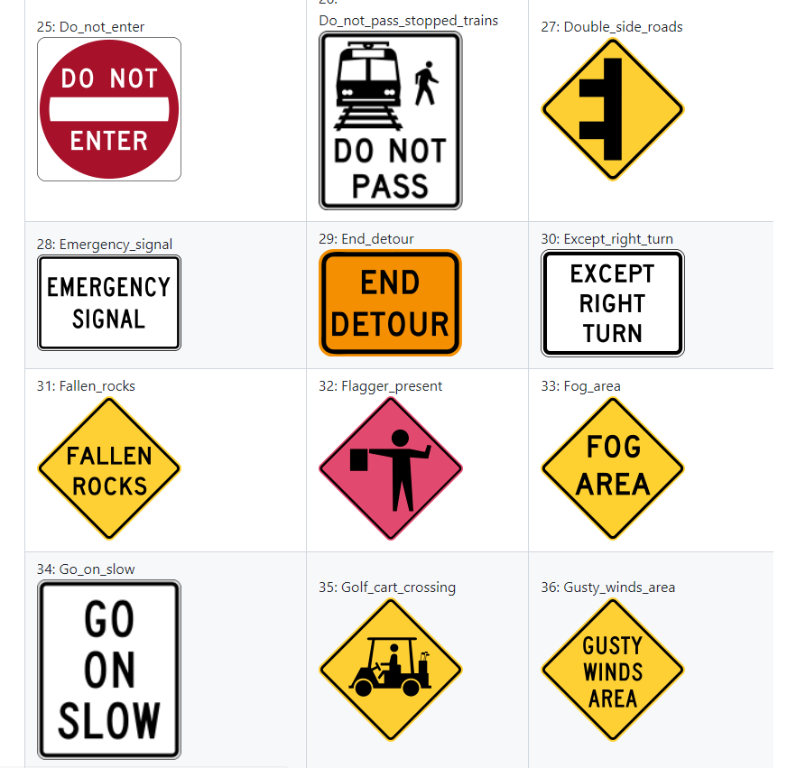

# KerasOCRTextBoxRecognizer
Keras-OCR Text Box Recognizer

This a simple command line client to Keras-OCR Text Recognizer. 

<h2> 
1 Install python venv
</h2>
Please create a python3 venv on Windows 11. 
and install it. We use Windows11 OS. 
<pre>
>python -m venv c:/py38-keras-ocr
>cd ./py38-keras-ocr
>scripts/activate
</pre>

 
<h2>
2 Install python packages
</h2>
Please clone this repository to your local PC. 
We use Python3 venv on Windows11 OS.
 
<pre>
>mkdir c:/keras-ocr
>cd c;/keras-ocr
>git clone https://github.com/zephyr-antillia/KerasOCRTextBoxRecognizer.git
>cd KerasOCRTextBoxRecognizer
>pip install requirements.txt
</pre>

<h2>
3 Sample Program
</h2>
Please open Windows Powershell console, and run the following command in the console window. 
<pre>
> python KerasOCRTextBoxRecognizer.py
</pre>

 
This <a href="./KerasOCRTexBoxRecognizer.py">KerasOCRTextBoxRecognizer.py</a> script reads the recognition.conf file. 
<pre>
[parameter]
images_dir   = "./samples"
output_dir   = "./preprocessed"
;image_format = ".png"

[preprocessor]
preprocessing    = True
gray_image       = True
image_scaling    = 3
contrast         = 1.5
sharpness        = 3

[visualizer]
font_name        = "arial.ttf"
draw_boundingbox = True
expanding_ratio  = 1.0
scaling_on_nonpreprocessing = 3
</pre>

Example 1: ARTIZON_MUSEUM.png 
 
 

Text Box Recognition: 

 

Example 2: Inference_Result.png 
 
 

Text Box Recognition: 

 

Example 3: RoadSign.png 
 
 

Text Box Recognition: 

 

Example 4: RoadSign_US.png 
 
 

Text Box Recognition: 

 

Example 5: SDGS.png 
 
 

Text Box Recognition: 

 

Example 6: USA_RoadSigns.png 
 
 

Text Box Recognition: 

 

Example 7: VSCodeScreenShot.png 
 
 

Text Box Recognition: 

 

